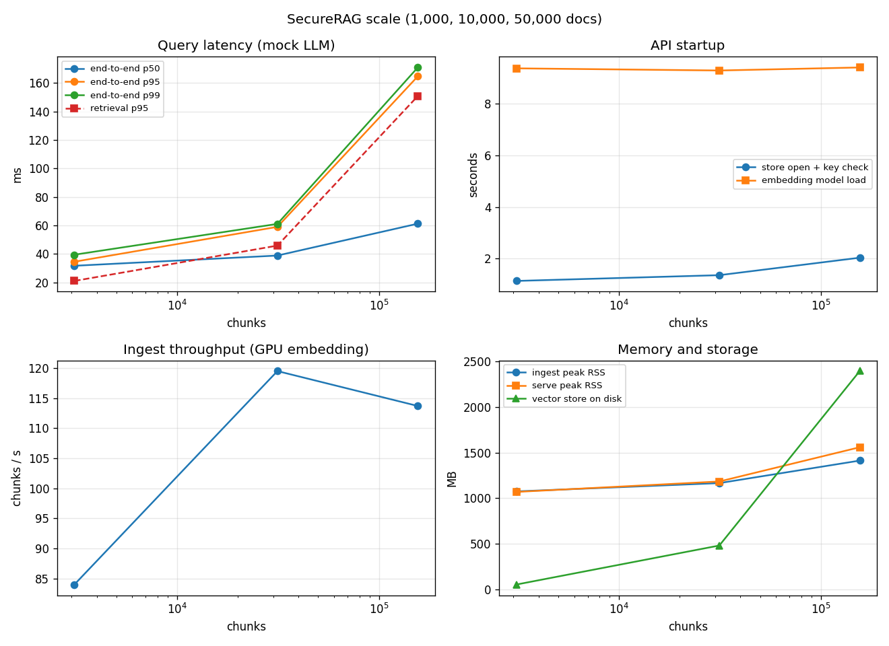

# SecureRAG — Evaluation Report

Generated 2026-09-29 00:42 from `reports/beir/*.json` and `reports/scale/phase6_docs_*.json`. Reproduce with the commands at the end.

> The earlier version of this report headlined *100% recall* measured on 5 hand-written documents.
> That fixture is still in the unit tests (`tests/test_evaluation.py`); it is not a benchmark.

Hardware: 8 CPUs, 15.8 GB RAM, NVIDIA GeForce GTX 1650 (embeddings on GPU), Windows-10-10.0.26200-SP0. LLM: deterministic mock (latency excludes generation).

## 1. Retrieval quality under RBAC (BEIR)

Documents get deterministic synthetic (department, clearance) labels and go through the real
pipeline (chunking, AES-GCM, partitioned HMAC BM25). Per role, a query is scored only against
the relevant documents that role may see. `exec` sees the whole corpus, so its row is
comparable to published BEIR numbers.

### fiqa — 57,638 docs, 74,748 chunks, 648 test queries

| Role (evaluable queries) | Mode | nDCG@10 | Recall@10 | Recall@50 | MRR@10 | Leaks |
|---|---|---|---|---|---|---|
| guest (109) | dense | 0.516 | 0.642 | 0.914 | 0.485 | 0 |
| guest (109) | sparse | 0.387 | 0.514 | 0.693 | 0.352 | 0 |
| guest (109) | hybrid | 0.512 | 0.693 | 0.879 | 0.470 | 0 |
| guest (109) | hybrid_rerank | 0.520 | 0.661 | 0.879 | 0.483 | 0 |
| employee (404) | dense | 0.414 | 0.522 | 0.722 | 0.430 | 0 |
| employee (404) | sparse | 0.253 | 0.328 | 0.508 | 0.266 | 0 |
| employee (404) | hybrid | 0.388 | 0.500 | 0.704 | 0.408 | 0 |
| employee (404) | hybrid_rerank | 0.417 | 0.512 | 0.704 | 0.433 | 0 |
| finance_lead (423) | dense | 0.420 | 0.521 | 0.693 | 0.437 | 0 |
| finance_lead (423) | sparse | 0.243 | 0.313 | 0.474 | 0.261 | 0 |
| finance_lead (423) | hybrid | 0.362 | 0.474 | 0.680 | 0.377 | 0 |
| finance_lead (423) | hybrid_rerank | 0.409 | 0.504 | 0.680 | 0.422 | 0 |
| exec (648) | dense | 0.375 | 0.447 | 0.627 | 0.447 | 0 |
| exec (648) | sparse | 0.223 | 0.285 | 0.419 | 0.274 | 0 |
| exec (648) | hybrid | 0.342 | 0.417 | 0.613 | 0.418 | 0 |
| exec (648) | hybrid_rerank | 0.376 | 0.443 | 0.613 | 0.449 | 0 |

### scifact — 5,183 docs, 9,982 chunks, 300 test queries

| Role (evaluable queries) | Mode | nDCG@10 | Recall@10 | Recall@50 | MRR@10 | Leaks |
|---|---|---|---|---|---|---|
| guest (22) | dense | 0.865 | 0.955 | 1.000 | 0.833 | 0 |
| guest (22) | sparse | 0.841 | 0.955 | 1.000 | 0.804 | 0 |
| guest (22) | hybrid | 0.881 | 0.955 | 1.000 | 0.856 | 0 |
| guest (22) | hybrid_rerank | 0.870 | 0.955 | 1.000 | 0.842 | 0 |
| employee (123) | dense | 0.793 | 0.911 | 0.951 | 0.753 | 0 |
| employee (123) | sparse | 0.758 | 0.846 | 0.943 | 0.731 | 0 |
| employee (123) | hybrid | 0.792 | 0.911 | 0.984 | 0.756 | 0 |
| employee (123) | hybrid_rerank | 0.805 | 0.919 | 0.984 | 0.770 | 0 |
| finance_lead (124) | dense | 0.779 | 0.914 | 0.944 | 0.741 | 0 |
| finance_lead (124) | sparse | 0.681 | 0.805 | 0.872 | 0.645 | 0 |
| finance_lead (124) | hybrid | 0.769 | 0.918 | 0.949 | 0.731 | 0 |
| finance_lead (124) | hybrid_rerank | 0.795 | 0.917 | 0.949 | 0.758 | 0 |
| exec (300) | dense | 0.657 | 0.811 | 0.890 | 0.612 | 0 |
| exec (300) | sparse | 0.620 | 0.751 | 0.846 | 0.583 | 0 |
| exec (300) | hybrid | 0.682 | 0.814 | 0.920 | 0.645 | 0 |
| exec (300) | hybrid_rerank | 0.699 | 0.841 | 0.920 | 0.662 | 0 |

## 2. Security at scale (synthetic corpus with canaries)

Each run sends 200 queries per role (topical, canary probes, injection-style probes).
A leak is a canary from a document the role may not read showing up in its answer or context.

| Docs | Chunks | Queries | Canary leaks | Injection detection (TP/FN) | Injection FPR | Role-spoof attempts | Escalations |
|---|---|---|---|---|---|---|---|
| 1,000 | 3,101 | 800 | **0** | 58.3% (14/10) | 0.0000% | 25 | **0** |
| 10,000 | 31,429 | 800 | **0** | 55.7% (108/86) | 0.0000% | 25 | **0** |
| 50,000 | 155,860 | 800 | **0** | 56.8% (571/434) | 0.0000% | 25 | **0** |

Injection detection is for the regex heuristics alone. Half of the planted payloads are
deliberately paraphrased to avoid those patterns, so this is a realistic lower bound;
`INJECTION_CLASSIFIER` adds an ML detector at ingest. Flagged chunks are wrapped as untrusted
data, and unflagged ones still sit inside the data-only context preamble.

## 3. Performance



| Docs | Chunks | Ingest (s) | Chunks/s | Ingest peak RSS (MB) | Store on disk (MB) | Startup: store open + key check (s) | Startup: model load (s) | Query p50 / p95 / p99 (ms) | Retrieval p95 (ms) |
|---|---|---|---|---|---|---|---|---|---|
| 1,000 | 3,101 | 36.92 | 84.0 | 1074 | 53 | 1.14 | 9.37 | 31.7 / 34.53 / 39.46 | 21.06 |
| 10,000 | 31,429 | 263.03 | 119.5 | 1165 | 481 | 1.36 | 9.29 | 38.87 / 59.01 / 61.09 | 45.85 |
| 50,000 | 155,860 | 1370.93 | 113.7 | 1412 | 2394 | 2.04 | 9.40 | 61.24 / 164.65 / 170.88 | 150.79 |

## 4. Qdrant server in Docker (GitHub Actions)

`docker compose` on a GitHub runner (4 CPUs, 15.6 GB RAM, no GPU): the API image against a Qdrant server with payload indexes, after an RBAC smoke test of the running container.
The hardware differs from sections 2–3, so compare how retrieval latency changes across roles, not the
absolute milliseconds. The spread is the slowest role's p95 divided by the fastest role's.

| Docs | Chunks | Queries | Canary leaks | Escalations | Chunks/s | Retrieval p95 by role (ms) | Spread | Chroma spread (§3) |
|---|---|---|---|---|---|---|---|---|
| 10,000 | 31,429 | 800 | **0** | **0** | 29.3 | guest 66, employee 70, finance_lead 70, exec 73 | 1.11× | 1.71× |
| 50,000 | 155,860 | 800 | **0** | **0** | 24.8 | guest 70, employee 72, finance_lead 69, exec 72 | 1.05× | 3.19× |

With Chroma, the more restricted the role, the slower its search (a metadata filter scans the matching rows);
Qdrant's indexed payload filter keeps every role at about the same latency.

## Reproduce

```bash
python scripts/eval_beir.py --datasets scifact fiqa
python scripts/benchmark_scale.py --docs 1000 --label phase6_docs_1000
python scripts/benchmark_scale.py --docs 10000 --label phase6_docs_10000
python scripts/benchmark_scale.py --docs 50000 --label phase6_docs_50000 --timeout 7200
python scripts/plot_scale.py --prefix phase6
python scripts/evaluate.py
```
